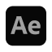
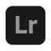

**Nice to meet you. 幸会。**

---

<a href="https://megakite.icu"> Blog" /></a>

’am an undergrad of computer science, formerly a motion designer & music producer.\
计科专业本科生，先前从事视觉设计和编曲工作。

’am currently, and will be working on various projects.\
正在做各种各样的东西，将来也会。

’am primarily using JavaScript (TypeScript), Rust and Haskell.\
主力语言是 JavaScript（TypeScript）、Rust 和 Haskell。

---

　　　　　

---

GPG public-key: <code>1453088D9302AFAC0D83C159EA6F9F590C5263B5</code>

